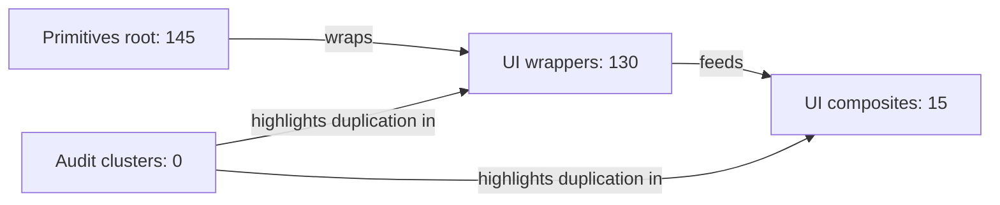

# DryUI Architecture Audit

## Metrics

| Metric | Count |
| --- | ---: |
| Primitive component nodes | 145 |
| UI component nodes | 145 |
| UI wrappers | 130 |
| UI composites | 15 |
| Compound parts | 662 |
| Mismatch count | 16 |
| PrimitivePart components | 0 |
| Thin wrapper count | 64 |

## Package Overview



## Duplication Clusters

```mermaid
flowchart TB
```

## Canonicalize Now

No findings in this bucket.

## Document Decision Tree

No findings in this bucket.

## Watch

No findings in this bucket.

## Structural Signals

- `PrimitivePart` appears in 0 UI components: none.
- Thin wrapper candidates: `Adjust`, `AspectRatio`, `Aurora`, `Avatar`, `Backdrop`, `Badge`, `Beam`, `Button`, `ButtonGroup`, `Checkbox`, `Chip`, `ChromaticAberration`, `ChromaticShift`, `Clipboard`, `Container`, `CountrySelect`, `Displacement`, `FocusTrap`, `FormatBytes`, `FormatDate`, `FormatNumber`, `Gauge`, `Glass`, `Glow`, `GodRays`, `GradientMesh`, `Hotkey`, `Icon`, `Image`, `ImageComparison`, `Input`, `Kbd`, `Label`, `Link`, `Marquee`, `MaskReveal`, `Noise`, `NumberInput`, `PhoneInput`, `Portal`, `Progress`, `ProgressRing`, `PromptInput`, `QRCode`, `Rating`, `RelativeTime`, `Reveal`, `ScrollArea`, `ScrollToTop`, `Separator`, `ShaderCanvas`, `Skeleton`, `Slider`, `Spacer`, `Sparkline`, `Spinner`, `Spotlight`, `Svg`, `Textarea`, `Toggle`, `Tour`, `VideoEmbed`, `VirtualList`, `VisuallyHidden`.
- UI subpath-only exports: none.
- Primitive subpath-only exports: `UseThemeOverride`.
- UI exports missing spec metadata: none.
- Primitive exports missing spec metadata: `AffixGroup`, `AppFrame`, `AvatarGroup`, `ChatMessage`, `EmptyState`, `Footer`, `Hero`, `LogoCloud`, `PageHeader`, `SelectableTileGroup`, `StatCard`, `Surface`, `User`, `UseThemeOverride`, `WaveDivider`.
- Docs nav missing components: none.
- Docs nav orphan entries: none.

## Mismatch Summary

- `spec-missing` in `primitives`: 15
- `subpath-only-export` in `primitives`: 1

## Priority Mismatches

- `spec-missing` on `AffixGroup` in `primitives` (packages/primitives/src/affix-group/index.ts): Public export exists without generated spec metadata.
- `spec-missing` on `AppFrame` in `primitives` (packages/primitives/src/app-frame/index.ts): Public export exists without generated spec metadata.
- `spec-missing` on `AvatarGroup` in `primitives` (packages/primitives/src/avatar-group/index.ts): Public export exists without generated spec metadata.
- `spec-missing` on `ChatMessage` in `primitives` (packages/primitives/src/chat-message/index.ts): Public export exists without generated spec metadata.
- `spec-missing` on `EmptyState` in `primitives` (packages/primitives/src/empty-state/index.ts): Public export exists without generated spec metadata.
- `spec-missing` on `Footer` in `primitives` (packages/primitives/src/footer/index.ts): Public export exists without generated spec metadata.
- `spec-missing` on `Hero` in `primitives` (packages/primitives/src/hero/index.ts): Public export exists without generated spec metadata.
- `spec-missing` on `LogoCloud` in `primitives` (packages/primitives/src/logo-cloud/index.ts): Public export exists without generated spec metadata.
- `spec-missing` on `PageHeader` in `primitives` (packages/primitives/src/page-header/index.ts): Public export exists without generated spec metadata.
- `spec-missing` on `SelectableTileGroup` in `primitives` (packages/primitives/src/selectable-tile-group/index.ts): Public export exists without generated spec metadata.
- `spec-missing` on `StatCard` in `primitives` (packages/primitives/src/stat-card/index.ts): Public export exists without generated spec metadata.
- `spec-missing` on `Surface` in `primitives` (packages/primitives/src/surface/index.ts): Public export exists without generated spec metadata.
- `spec-missing` on `User` in `primitives` (packages/primitives/src/user/index.ts): Public export exists without generated spec metadata.
- `spec-missing` on `UseThemeOverride` in `primitives` (packages/primitives/src/use-theme-override/index.ts): Public export exists without generated spec metadata.
- `spec-missing` on `WaveDivider` in `primitives` (packages/primitives/src/wave-divider/index.ts): Public export exists without generated spec metadata.
